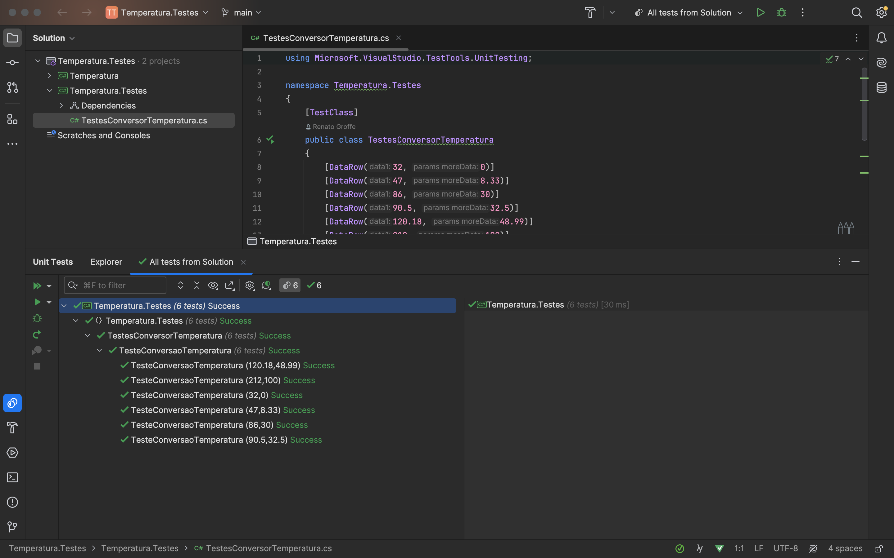

# aplicando-testes-s6

Essa atividade tem o objetivo de mostrar diferentes formas de realizar testes unitários em uma mesma função, sendo eles com xUnit, NUnit e MSTest. Essa é bem simples, uma vez que tranforma temperaturas dadas em Fahrenheit para Celcius. A função é dada a seguir:

```cs
using System;

namespace Temperatura
{
    public static class ConversorTemperatura
    {
        public static double FahrenheitParaCelsius(double temperatura)
            //=> (temperatura - 32) / 1.8; // Simulação de falha
            => Math.Round((temperatura - 32) / 1.8, 2);
    }
}
```

## Testes com xUnit

A biblioteca xUnit é muito popular quando o assunto são testes unitários em .NET. A estrutura do teste feito com o framework pode ser vista abaixo:

```cs
using System;
using Xunit;

namespace Temperatura.Testes
{
    public class TestesConversorTemperatura
    {
        [Theory]
        [InlineData(32, 0)]
        [InlineData(47, 8.33)]
        [InlineData(86, 30)]
        [InlineData(90.5, 32.5)]
        [InlineData(120.18, 48.99)]
        [InlineData(212, 100)]
        public void TestarConversaoTemperatura(
            double fahrenheit, double celsius)
        {
            double valorCalculado =
                ConversorTemperatura.FahrenheitParaCelsius(fahrenheit);
            Assert.Equal(celsius, valorCalculado);
        }
    }
}
```

Como é possível perceber, foram testados 6 diferentes casos, e o resultado está a seguir:

<p align="center">
    
    </br>
</p>


## Testes com NUnit

A biblioteca NUnit também é muito usado em testes unitários em .NET. Esse framework é amplamente utilizado devido à sua robustez e facilidade de uso. A estrutura do teste feito com o framework pode ser vista abaixo:

```cs
using NUnit.Framework;

namespace Temperatura.Testes
{
    public class TestesConversorTemperatura
    {
        [TestCase(32, 0)]
        [TestCase(47, 8.33)]
        [TestCase(86, 30)]
        [TestCase(90.5, 32.5)]
        [TestCase(120.18, 48.99)]
        [TestCase(212, 100)]
        public void TesteConversaoTemperatura(
            double tempFahrenheit, double tempCelsius)
        {
            double valorCalculado =
                ConversorTemperatura.FahrenheitParaCelsius(tempFahrenheit);
            Assert.AreEqual(tempCelsius, valorCalculado);
        }
    }
}
```

Como é possível perceber, a estrutura é igual a do teste anterior, então também foram testados 6 diferentes casos, e o resultado está a seguir:

<p align="center">
    
    </br>
</p>

## Testes com MSTest

A biblioteca MSTest foi desenvolvida pela Microsoft e também é usada em testes unitários em .NET. O framework é integrado ao Visual Studio e é uma das opções oficiais para a escrita e execução de testes em aplicações. A estrutura do teste feito com o framework pode ser vista abaixo:

```cs
using Microsoft.VisualStudio.TestTools.UnitTesting;

namespace Temperatura.Testes
{
    [TestClass]
    public class TestesConversorTemperatura
    {
        [DataRow(32, 0)]
        [DataRow(47, 8.33)]
        [DataRow(86, 30)]
        [DataRow(90.5, 32.5)]
        [DataRow(120.18, 48.99)]
        [DataRow(212, 100)]
        [DataTestMethod]
        public void TesteConversaoTemperatura(
            double tempFahrenheit, double tempCelsius)
        {
            double valorCalculado =
                ConversorTemperatura.FahrenheitParaCelsius(tempFahrenheit);
            Assert.AreEqual(tempCelsius, valorCalculado);
        }
    }
}
```

Como é possível perceber, a estrutura é igual a dos dois testes anteriores, então também foram testados 6 diferentes casos, e o resultado está a seguir:

<p align="center">
    
    </br>
</p>